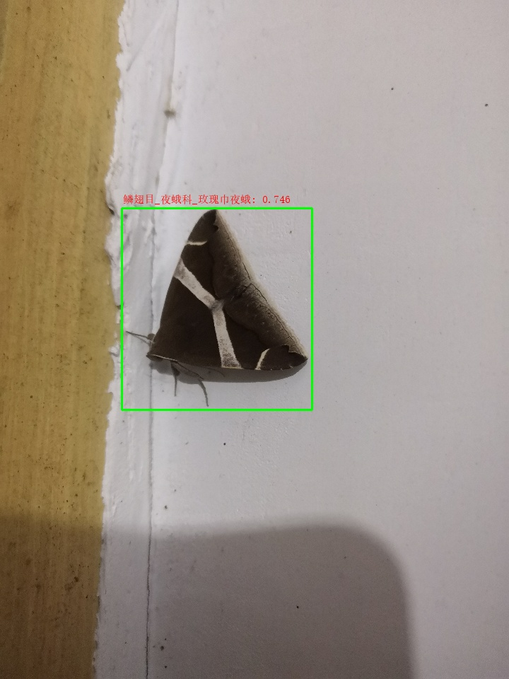
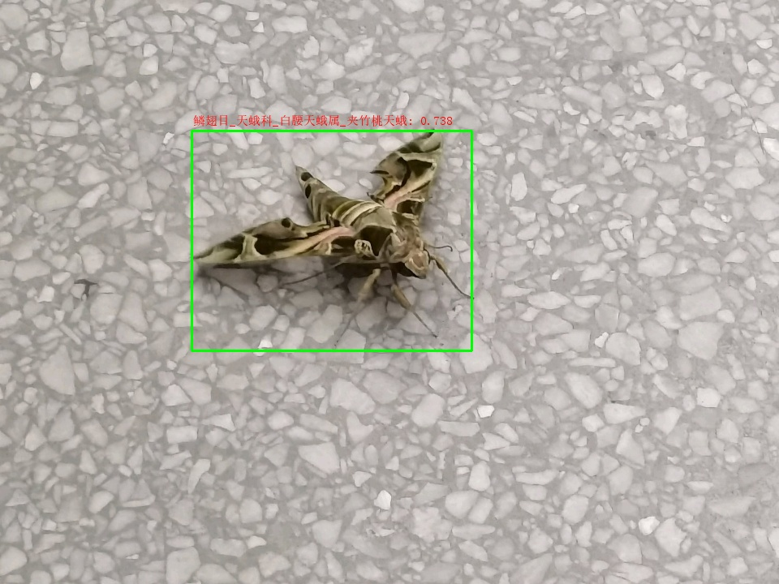
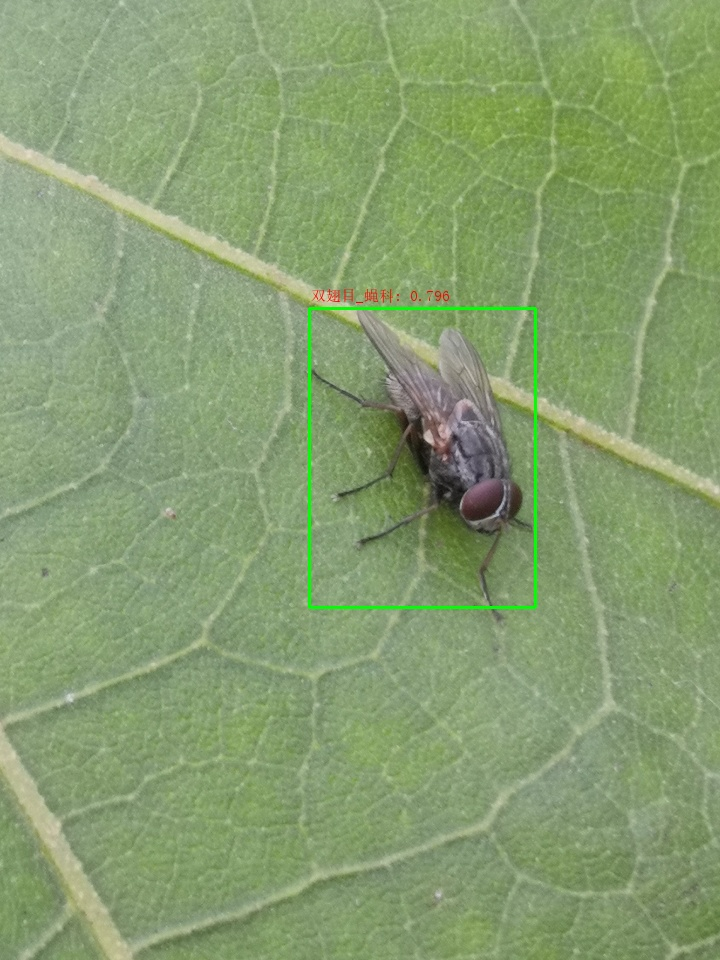
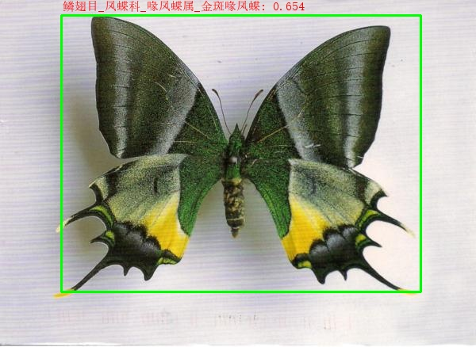

# 特性
- 支持 1702 类 (可能是目, 科, 属或种) 昆虫或其他节肢动物
- 模型开源, 持续更新.

# 安装
先安装 Anaconda, 然后执行
```
git clone https://github.com/quarrying/quarrying-insect-id.git
cd quarrying-insect-id
conda create -n insectid python=3.6 -y
conda activate insectid
pip install -r requirements.txt
```

# 用法 

参考 [demo.py](<demo.py>).


# 例图










# ChangeLog

- 20211011 更新检测模型.
- 20211009 更新识别模型, 支持 1702 个昆虫分类单元, top1/top5 准确率为 0.915/0.973.
- 20210920 更新识别模型, 支持 1534 个昆虫分类单元.
- 20210908 更新识别模型, 支持 1372 个昆虫分类单元.
- 20210825 更新识别模型, 支持 1234 个昆虫分类单元.
- 20210815 更新识别模型, 支持 1068 个昆虫分类单元.
- 20210801 更新识别模型, 支持 868 个昆虫分类单元.
- 20210713 更新检测模型.
- 20210712 更新识别模型, 支持 840 个昆虫分类单元.
- 20210704 更新识别模型, 支持 820 个昆虫分类单元.
- 20210701 发布模型, 支持昆虫(或其他节肢动物)检测及 786 个昆虫(或其他节肢动物)分类单元(可能是目, 科, 属或种等)的识别.
